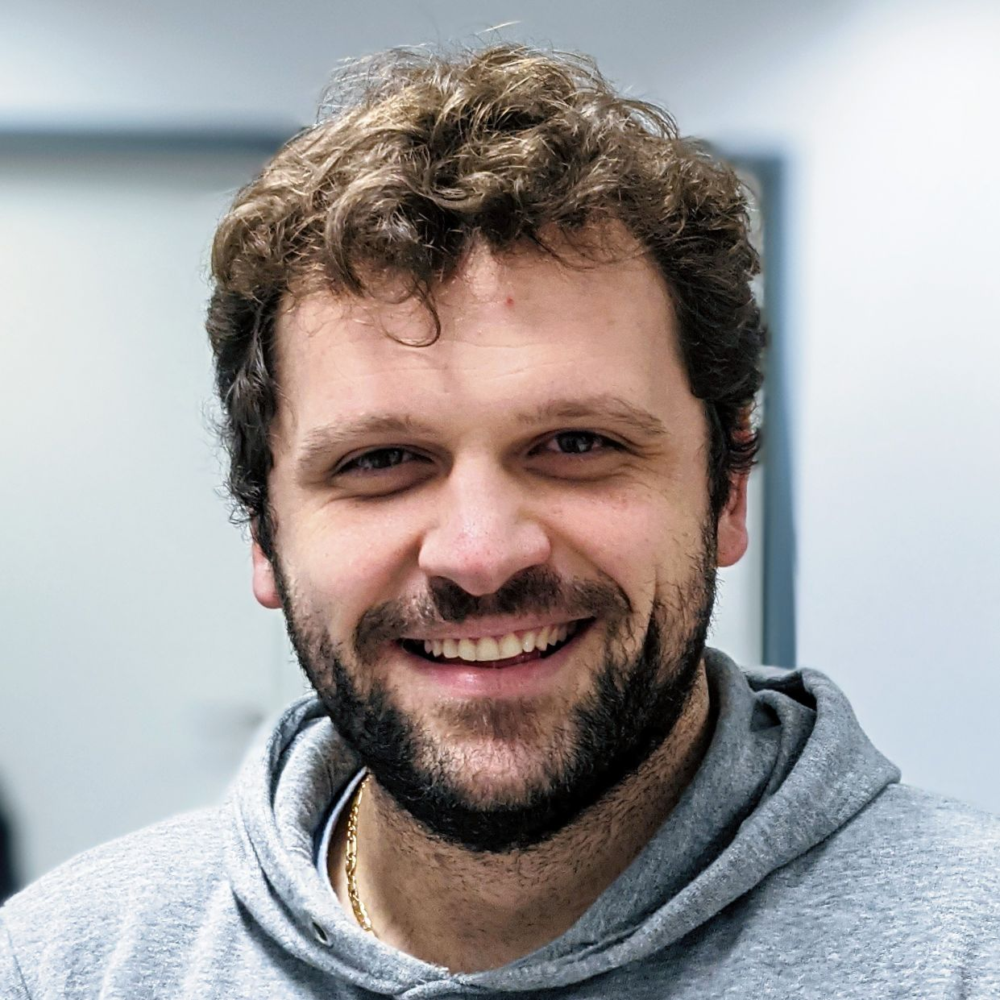
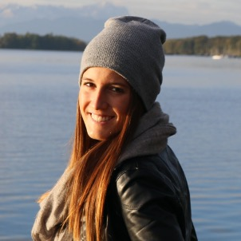

## Content
Domain adaptation and generalization is crucial for a wide range of vision tasks, such as image classification, semantic segmentation, or video recognition, thus laying the basis for everyday applications like smart arrangement of image collections on our smartphones, web-scale image search in our brower or monitor public safety. Today, the predominant approach for domain adaptation and generalization that learn domain-invariant visual representations is adversarial learning. which specifically aims at aligning the visual representations of different domains. Moreover, self-supervised learning is also applied to domain adaptation and generalization, which is promising direction.

In this tutorial we will provide an in-depth coverage of the recent advances in domain adaptation and generalization and also applications and future directions. Specifically, the tutorial will cover the following subjects: <i>(1)</i> background on domain adaptation, <i>(2)</i> recent advances in domain adaptation, <i>(3)</i> domain adaptation vs. domain generalization, <i>(4)</i> recent advances in domain generalization and finally, <i>(5)</i> we provide applications and future perspectives of domain adaptation and generalization.

---
## Info

<ul>
<li><b>Time</b>: Sunday, 06/18/2023, 8:30am GMT-7.</li>
<li><b>Location</b>: TBD </li>
<li><b>Online</b>: Find the link in the official virtual platform of CVPR 2023</li>
<li><b>Primary contact</b>: ronghangzhu@gmail.com </li>
</ul>

--- 
## Organizer

  

    	

	
	

	<a href="https://timomilbich.github.io/">Timo Milbich</a>   LMU Munich, Heidelberg University   timo.milbich@iwr.uni-heidelberg.de
	

	

	&nbsp;

       	

	
	

	<a href="https://dvl.in.tum.de/team/elezi/">Ismail Elezi</a>   Technical University of Munich   ismail.elezi@tum.de
	

	

	&nbsp;

       	

	
	

	<a href="https://ommer-lab.com/people/ommer/">Björn Ommer</a>   LMU Munich, Heidelberg University   ommer@lmu.de
	

	

  

  

       	

	
	

	<a href="https://dvl.in.tum.de/team/seidenschwarz/">Jenny Seidenschwarz</a>   Technical University of Munich   j.seidenschwarz@tum.de
	

	

	&nbsp;

       	

	
	

	<a href="https://dvl.in.tum.de/team/lealtaixe/">Laura Leal-Taixe</a>   Technical University of Munich   leal.taixe@tum.de
	

	

  

